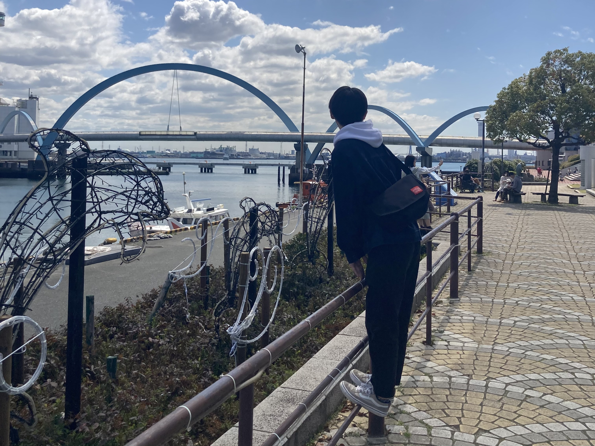

## 基本
> - **名前**
> 真中遥道
> - **出身地**
> 神奈川県
> - **誕生日**
> [夏至生まれ](/literature/夏至生まれ/#夏至生まれと覚えて)
> - **好きな色**
> 青
> - **好きな動物**
> くじら
> - **好きな植物**
> 金木犀
> - **好きな料理**
> 肉巻き豆腐
> - **好きな飲み物**
> 紅茶、コーラ、チャイティーラテ、Swiss Missのココア
> - **好きな場所**
> 左京区、鴨川、大文字
> - **好きなもの**
> 季節変わり
> - **好きな漫画**
> マイブロークンマリコ
> - **好きな映画**
> エターナルサンシャイン
> - **趣味**
> 音楽、文芸、数学、ランニング
> - **行ってみたい場所**
> 極夜
> - **最近の発見**
> 白夜って夜じゃなくて長い昼
> - **マイブーム**
> コーヒー、人狼（2026年01月）
> - **寝る時の体勢**
> うつ伏せ
> - **春といえば**
> 桜、新しい教科書の匂い
> - **夏といえば**
> 火薬の匂い、鴨川に足浸し
> - **秋といえば**
> 金木犀、夕方の匂い
> - **冬といえば**
> みかん、ココア、人肌恋しさ
> - **朝方？夜型？**
> 夜型
> - **弱点**
> すぐお腹痛くなる
> - **悲しいこと**
> 忘れられること
## 過去
> - **小学校でやってたこと**
>     - サッカークラブ
>     - 体操クラブ
>     - 水泳クラブ
>     - フラグフット
>     - 体育の時間にホームシックで号泣
>     - 一年間半袖半ズボン（その後反動でしばらく長袖長ズボン）
>     - 自由帳を迷路で埋める
>     - モテる
>     - 微分を理解
>     - 応援団長
>     - 友達と空想話（スーパー赤ちゃんシリーズなど）
>     - 積分で挫折
>     - 探偵団ごっこ（クラスの恋愛相関図作成など）
> - **中学でやってたこと**
>     - サッカー部
>     - 駅伝部
>     - 放送委員会
>     - ギターを弾き始める
>     - 文通
>     - 初めての引越
>     - 文化祭で友達とデュオ
>     - 初めての告白、付き合う
>     - 応援団長
>     - 駅伝を走る
>     - それと知らず金木犀の匂いを知る
>     - 振られる
> - **高校でやってたこと**
>     - 陸上部（長距離）
>     - 文芸部
>     - 携帯をゲット
>     - 放課後の教室でギター弾いて友達とハモる
>     - 二度と経験したくない地獄の夏合宿
>     - 初めて友達と疎遠になる
>     - 駅伝
>     - 京都へ人生初弾丸旅行
>     - 短歌を始める
>     - 駅伝
>     - ピアノ曲を作る
>     - 文化委員長、行事縮小する学校へ抵抗
>     - 駅伝
>     - 文化祭で友達とデュオ
>     - 駅伝駅伝駅伝
>     - 遅刻生活
>     - 受験不合格
> - **浪人でやってたこと**
>     - 駿台横浜、フロホに入り浸る
>     - 横浜の祖父母のもとで一年暮らす
>     - 友達なんやかんやできる
>     - みなとみらいのスタバに入り浸る
>     - 11月でE判定を叩き出す
>     - 頑張る
>     - 合格する
> - **大学でやってたこと**
>     - 京大短歌
>     - 多摩短歌会
>     - 京都で一人暮らし
>     - 自主ゼミ
>     - 失恋大ダメージ
>     - アマングアス
>     - ウミノカナタ（音楽ユニット）
>     - S自ボックスで徹夜
>     - 塾講バイト
>     - 院試勉強
>     - ミソヒト（バンド）
>     - 金木犀生息地調査（本部構内に大きな金木犀を発見）
>     - 喫茶店バイト
## 数学
> - **大学で学んでること**
> 数学。専門は整数論。
> - **数学の好きなところ**
> 概念の一般化
> - **数学で興味のないこと**
> 円周率が超越数か、みたいな個別具体的な問題
> - **数学でのこだわり**
> 「気持ち」とか「モチベーション」
## 音楽
> - **音楽で好きなこと**
>     - 歌うこと、ハモること
>     - 編曲（同じメロディーに違うコード進行当てるのとか好き。例えば[嵐のMonster](https://youtu.be/JedKBJVHhiE?si=j1nggjFW2JP538O4)のサビとかは凄すぎ）
> - **好きなコード進行**
> IV → V/IV → IIIm7-5 → VI7。（IIIm7-5の減5度が切なくて胸がぎゅってなる。[銀杏並木のセレナーデ](https://youtu.be/uk5r56jbVZg?si=uh5vnKA8QrIdsmnF&t=87)の「眠れない日々がまた来るのなら」とか[心の瞳](https://youtu.be/em_zyIQRe40?si=GAyjWI-uSz9Pt0Xv&t=63)の「君だけが今では」とか）
> - **好きなアーティスト**
>     - ゆず
>     - ZARD
>     - SEKAI NO OWARI
>     - 星野源
>     - Justin Bieber
>     - 久石譲
>     - あいみょん
>     - YOASOBI
>     - Ayase
>     - Vaundy
>     - UlulU
> - **楽器**
> ギター
## 陸上
> - **やっていた陸上種目**
>     - 5000m
>     - 3000mSC（ハードルと水濠のある3000m走る）
>     - 駅伝
> - **ベストタイム**
>     - 5000m15分54秒（一桁秒はうろ覚え）
>     - 3000mSC10分00秒（一桁秒はうろ覚え）
> - **ランニングフォーム**
> フォアフット
## 恋愛
> - **好きなタイプ**
> だる絡みをあしらってくれる人、話し合ってくれる人
> - **初恋**
> 幼稚園の年少さん
> - **キュンとするのは**
> 髪が長い人がショートにしたとき
## その他
> - **近影**
> 
