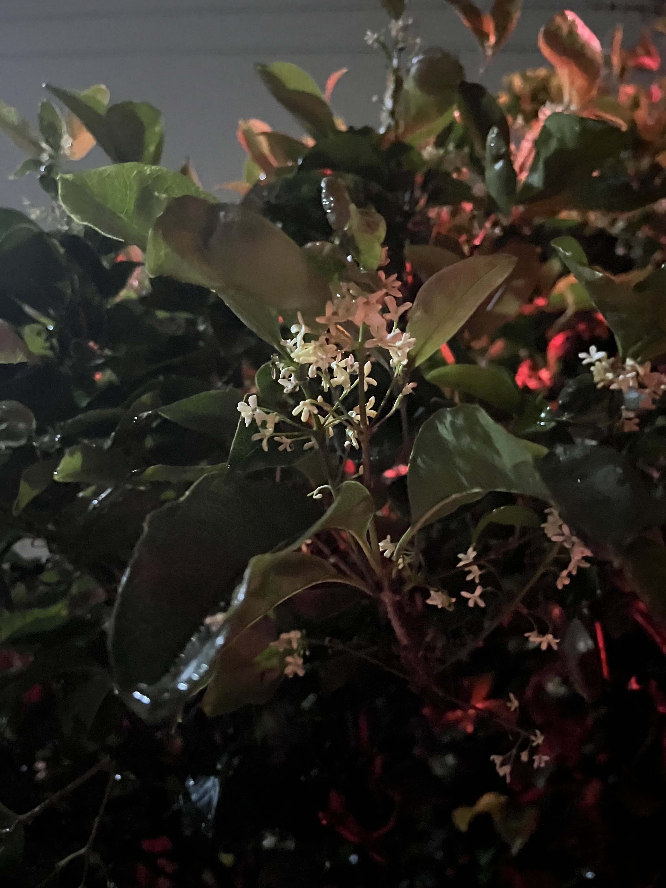

カフェベースで昼下がりまでアルバイトをして、そこから富塚と落ち合って百万遍のマックで作業をした。DL基礎の事前学習の統計と情報理論のあたりをやった。応用よりのせいか、定義域が違う関数を同一視して同じ記号で書いていたり、慣例が数学と違って混乱した。数学を勉強していたおかげで理解にそこまで時間がかからず、久しぶりに人生の伏線回収が起きた気がした。

帰り道いい匂いがして立ち止まった。民家の庭に生えてる木からの匂いだった。調べたら「オマツリライトノキ」らしい？木犀以外で初めて感じる街中の植物の香りだった。

