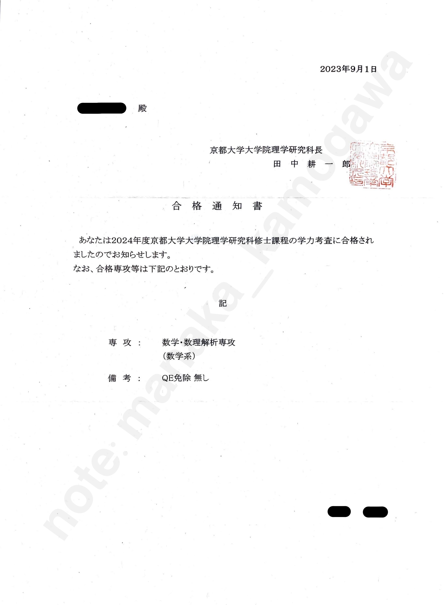
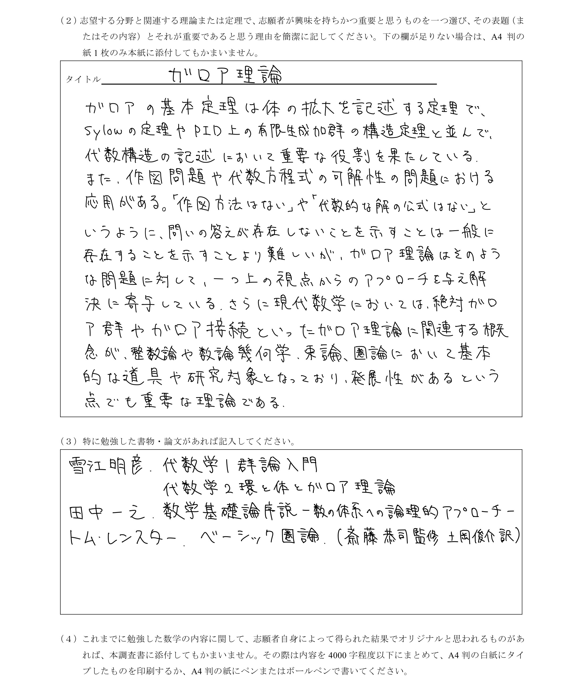

最終更新：2025-09-01

　本稿は**京都大学理学部理学研究科数学専攻**の**2024年度**大学院修士課程入学試験の受験記である．
　院試は学部入試に比べて情報が少ないため後進のために記録を残しておく．読者としては京大数学教室受験者を想定している．**古い情報も含まれるので，[数学教室HPの大学院入試のページ](https://www.math.kyoto-u.ac.jp/ja/applicant-guidelines)や入試要項から最新情報を必ず確認されたい**．また，大変長いので各自必要なところを目次より選んで読まれたい．

目次
- [2025年度以降の体験記](#2025年度以降の体験記)
- [私について](#私について)
- [院試概要](#院試概要)
- [院試対策・結果](#院試対策結果)
- [役立つ記事](#役立つ記事)
- [さいごに](#さいごに)
- [参考文献](#参考文献)

## 2025年度以降の体験記
　新しいものの方が参考になるだろうということで、2025年度以降の京大院数学教室とRIMSの受験記で見つけたもの（信頼できるだろうもの）を貼っておく。（書いた人、見かけた人は[わたし]({})に教えてくれれば載せます）



## 私について
　私のプロフィールは以下．

> 在籍：京都大学理学部数理科学系4回生（2023年度時点）  
> 専門：代数系（課題研究は数学基礎論）  
> 成績：累積GPA2.35（3回後期終了時）  
> 急がば回れ度：1浪0留

　2024年4月からは京都大学理学部理学研究科数学専攻に進学する．記事の信憑性のためにも合格通知書を掲載しておく．

## 院試概要
　院試の仕組みや流れなどを説明する．繰り返しになるが，**古い情報も含まれるので，[数学教室の大学院入試のページ](https://www.math.kyoto-u.ac.jp/ja/applicant-guidelines)や入試要項から最新情報を必ず確認すること**．

### 二つの大学院：数学教室とRIMS
　京都大学には数学系の大学院が**数学専攻（数学教室）**と**数理解析専攻（RIMS）**の二つある．前者は理学研究科の数学教室に属し，後者は数理解析研究所（RIMS）に属する．（参考：[1](https://www.kyoto-u.ac.jp/ja/about/organization/head/charts)）

　両者の特徴は色々あるが，例えば**在籍する教員，博士課程進学率，定員**に違いがある．在籍する教員については，例えば2023年8月現在では

- RIMSには数学基礎論周辺が専門の教員がいるが数学教室にはいない
- 数論についてはRIMSは数論幾何が主で，数学教室は解析的整数論が主

など分野によっては違いがあるところがある．志望分野周辺の教員の専門分野を細かく調べることが望ましいだろう．必要に応じてメールなどでコンタクトを取り話を伺いに行くことも望まれる．（元々コネクションがなくても連絡すれば大体応じてくれる）博士課程進学率に関しては，数学教室では年によりばらつきがあるがおよそ10%から40%であり，RIMSではほぼ100%と思われる．（参考：[2](https://www.math.kyoto-u.ac.jp/ja/overview/career-outlook), [3](https://www.kurims.kyoto-u.ac.jp/daigakuin/RIMS_recruit2024.pdf)）また定員については2024年度の場合を挙げれば

- 数学専攻42名
- 数理解析専攻10名

となっている．（参考：[4](https://sci.kyoto-u.ac.jp/sites/default/files/2023-04/01_applicaton%20guidelines.pdf)）両院合わせて定員が52名あり，京大理学部数理科学系の定員である57名から就職勢分を差し引いた人数をカバーしているといったところだろうか．~~しかし実際は，他大学からの受験者が目ん玉が飛び出るほどいるため「無能は出てってください」状態になっている．~~

　逆に両者の共通することは，どちらも京大の吉田キャンパス（の北部構内，RIMSの一部は本部構内）に所在するという点と，筆答試問を共有しているという点だ．複数の大学院に出願する場合，普通は各大学院の試験をそれぞれ受けなければならないが，数学教室とRIMSを併願する場合には，両院共通の筆答試問を受け，各院の口頭試問をそれぞれ受けることになる．筆答試問が一つのみという点で両院の併願は負担が少ないといえるだろう．しかし，願書，口頭試問は別であること，筆答試問も分野によっては解答する問題が異なることには注意が必要である．（特にRIMSの願書は数学教室のそれよりも内容が多く，作成が大変そうという印象を個人的には受けた）

### QEについて
　数学教室では博士前期課程（修士課程）から博士後期課程に進学するために，博士後期課程進学資格試験（Qualifying Examination = QE）に合格する必要がある．入学試験で優秀な成績を修めるとこれを免除（QE免除）されることがあり，合格発表の際に合格者にはQE免除あり，QE免除なしが通知される．QE免除を受けると，大学院入学時から指導教官が付くことになる．詳しくは[こちら[5]](https://www.math.kyoto-u.ac.jp/ja/%E3%82%B3%E3%83%B3%E3%83%86%E3%83%B3%E3%83%84%E3%83%AA%E3%82%B9%E3%83%88/%E5%8D%9A%E5%A3%AB%E5%BE%8C%E6%9C%9F%E8%AA%B2%E7%A8%8B%E9%80%B2%E5%AD%A6%E8%B3%87%E6%A0%BC%E8%A9%A6%E9%A8%93%EF%BC%88qe%EF%BC%89)を参照．またQE免除については合格ラインの項も参照．

### 日程・出願
**日程**
　入学試験の流れは以下の通り．**（日付は2023年実施のもの）**

> 4/19　入試要項公開  
> 6/2 　数学教室院試説明会（オンライン，対面）  
> 6/16　RIMS院試説明会（オンライン）  
> 6/26  
> 　|　　出願期間  
> 6/30  
> 8/19　筆答試問  
> 　　　　9:00-12:30　基礎科目  
> 　　　　13:45-16:15　専門科目  
> 8/20　筆答試問  
> 　　　　9:00-10:00　英語  
> 　　　　13:30　一次試験合格者発表  
> 　　　口頭試問  
> 　　　　14:00-  
> 8/21　口頭試問  
> 　　　　9:00-  
> 9/1 　合格発表

**出願**
　提出する書類は

- 理学研究科で共通の書類
- 志望専攻ごとに異なる調査書

がある．
　前者は入学願書や履歴書といったものだ．私は入試要項を珍しくちゃんと読み込み，しっかり者の友人と一緒に清書をした．（これが安心感があってよかった．一緒に書くと口頭で確認し合うので見落としに気づきやすい．~~もしミスがあっても道連れがいるので孤独にならない~~）
　後者は数学専攻と数理解析専攻で異なる．私は数学専攻にのみ出願した．数学専攻の調査書は「志望する分野と関連する理論または定理で，興味を持ちかつ重要と思うもの，その理由」がメインの設問であった．私は数論志望であったのでガロア理論について書いた．私は聞かれなかったが**口頭試問でここに書いた内容について触れられた人もいた**ので，無理な背伸びはすべきではないかもしれない．

　また「志願者自身によって得られた結果でオリジナルと思われるもの」があれば添付しても良いとのことで，幾何学演義IIの授業で考えた「一般化蛇の補題」についてまとめた原稿があったので，それを指定字数に収まるように手直しし提出した．（志望分野と微妙にずれていたからか）口頭試問では全く触れられなかったので，正直どれほど選考に影響しているのかわからない．傑出した結果であれば加点になるが，でなければ全く加味されないのかもしれない．私が提出したレポートは以下．元の原稿はリンクのnote記事を参照．



### 入学試験
　入学試験は以下からなる．

> **筆答試験**  
> ・基礎科目（3時間30分，300点満点）  
> ・専門科目（2時間30分，200点満点）  
> ・英語（1時間，A〜D）**※2024年度以前**  
> **口頭試問**  
> ・評価観点I（A〜E）  
> ・評価観点II（A〜E）

**基礎科目**
　試験時間：3時間30分
　配点：300点
　出題内容：学部1,2回（京大理学部の講義で言えば線形，微積から〇〇学入門まで）の内容．数学専攻志望は大問1-6が必答で，数理解析専攻志望は必答問題と選択問題がある（必答のみの年も）．ここ8年の大問1-6の出題内容は以下．

> 2024　積分，線型，線型，微積，複素，多様体  
> 2023　積分，線型，線型，微積，微分方程式，多様体  
> 2022　積分，線型，群論，微積，複素，多様体  
> 2021　（COVID-19の影響で筆答試問は実施されず）  
> 2020　積分，線型，線型，微積，複素，多様体  
> 2019　積分，線型，微分方程式，微積，線型，微積  
> 2018　積分，線型，複素，微積，群論．多様体  
> 2017　積分，線型，線型，微積，微分方程式，位相

　これ見てわかるとおり，基礎科目には明白な出題傾向がある．具体的には

> 線型代数：固有値・階数の計算  
> 微分積分：重積分，広義積分の収束発散，  
> 複素解析：留数定理  
> 多様体：正則値定理

は**超頻出**である．これらの問題を完璧にすれば傾向が変わらない限り3完はかたいだろう．逆にベクトル解析は全くと言っていいほど出題されない．これら以外にも出題傾向がかなりあるので過去問研究はすると良いだろう．

**専門科目**
　試験時間：2時間30分
　配点：200点
　出題内容：概ね学部3,4回（京大理学部の講義で言えば代数学I,II,幾何学I,II,解析学I,II,etc…）の内容．各分野2,3題ほど出題され，2題を選択し解答する．数学専攻か数理解析専攻かで選択できる問題に多少違いがある．代数系については，ここ8年の出題内容は以下．

> 2024　群，可換環，体  
> 2023　群，可換環  
> 2022　有限体上の線形，体，可換環  
> 2021　（COVID-19の影響で筆答試問は実施されず）  
> 2020　群，体，可換環  
> 2019　可換環，群，体  
> 2018　可換環，群，体  
> 2017　群，可換環，体

　基礎科目ほど対策は簡単ではないが，ちゃんと対策すれば1完できる実力はつくだろう．

**英語** ※2024年度以前
　試験時間：1時間
　配点：A〜Dで評価
　出題内容：大問1が英文和訳，大問2が和文英訳と英作文である．大問1は英語で書かれた数学の教科書や数学に関係した文章の和訳をする．大問2は数学の簡単な問題（学部1回相当）を英訳し，その問題の解答を英語で作成する．いずれも難易度は高くないが、数学英語特有の言い回しや語彙を習得する必要がある．

**※2025年度入試から英語の形式に変更がある告知がされた．以下参照．**


**口頭試問**
　口頭試問は一次試験（筆答試問）合格者のみが受けられる．
　配点：評価観点がI,IIの２つありそれぞれA〜Eで評価（評価観点がそれぞれどこかは不明）
　試験時間：人による．私や友人らは大体15-30分程度だったが，中には5分で終わったり，45分ほどかかった人もいたよう．
　出題内容：口頭試問については実態がよくわかっていないので，私の場合を記載する．口頭試問では大きく

> (1)事務的なこと  
> (2)筆答試問について  
> (3)志望分野について

が訊かれた．(1)では受験番号，名前を，さらに選考に関係しないと断りがあった上で併願状況，博士課程進学を希望するかを訊かれた．(2)ではまず筆記試験のできを聞かれ，できなかったが試験後解けた問題の解答を発表させられた．その後その問題について追加で質問をされた．(3)では，志望分野について今までどんな勉強をしてきたかを訊かれた．
　筆答試問についてはおそらく訊かれるので，口頭試験までに解けなかった問題は解き直せているのが理想である．私は1日目筆答試問終了後と2日目英語の試験終了後に院試対策ゼミのメンバーで集まり，解答の確認と解けなかった問題の解き直しを行った．（私の把握している限り2024年度時点ではこれは禁止されていない）
　口頭試問の詳しい内容については以下を参照．



### 合格ライン
　明確な根拠はないが色々な人の話を聞いた感じ，基礎科目4完がボーダー，基礎科目5完以上かつ専門科目1完で安心，という塩梅だと私は思っている．専門科目は難しい分問題の運も結構あるので，基礎科目全完は確実に狙っていかなければならないだろう．なお院試対策ゼミメンバーのうちで2024年度筆答試問通過の最低点は友人Iの310/500である．結果の項に記載の開示成績を参照．
　またQE免除については院試対策ゼミメンバーの開示成績をみるところ，口頭試問が比較的重要視されるようだ．間違った数学的な議論をしないことは肝要であると思われる．ただし大学院に向けてどのような勉強をしてきているか，などの点は背伸びして回答する必要はないようだ．友人Tは全くしていないと答えたが口頭試問の成績はI,IIともにAであった．こちらも結果の項に記載の開示成績を参照．

### 受験者数データ
　2024年度入試のデータをまとめておく．データは私が筆答試問座席表や合格者発表などから集計したものである．

> **定員**  
> 　数学教室：42人  
> 　RIMS：10人  
>  
> **受験者数**  
> 　数学教室専願（0番台）：99人  
> 　数学教室>RIMS（500番台）：4人  
> 　RIMS専願（1000番台）：2人  
> 　RIMS>数学教室（1500番台）：11人  
>  
> **倍率**　※第2志望者を含めた  
> 　数学教室：約2.7倍  
> 　RIMS：1.7倍  
>  
> **一次試験合格者**  
> 　数学教室：70人  
> 　（数学教室専願：60人，数学教室>RIMS：3人，RIMS>数学教室：7人．合格率：約61%）  
> 　RIMS：16人  
> 　（数学教室>RIMS：4人，RIMS専願：1人，RIMS>数学教室：11人．合格率：約94%）  
>  
> **合格者数**  
> 　数学教室：50人（QE免除有り：20人）  
> 　RIMS：7人

## 院試対策・結果
　具体的にどのような勉強したかを紹介する．なお紹介する教科書などは一覧にして参考文献の項に記載する．

### 基礎科目
　友人と4人で院試対策ゼミを組んで勉強していた．これがモチベーションの維持や勉強ペースのキープにとても良かったので，**院試対策ゼミを組むことを心底おすすめする**．
　勉強の流れとしては，各分野の復習を順番にし，それから過去問演習に取り組んだ．時期，個別の内容は以下．（月は4回生になる年のもの）

> ・微分積分の復習（1月下旬-3月中）  
> ・微分方程式の復習（3月下旬）  
> ・線型代数の復習（4月）  
> ・群論の演習（5月上旬）  
> ・多様体の演習（5月下旬）  
> ・過去問演習（&複素積分）（6-8月）

　院試対策ゼミは，春休みの間は3日に1回，学期が始まってからは週1回のペースで，各回10問ずつ問題を決め各自予習し，解答を発表，共有する形式で行った．

**微分積分の復習（1月下旬-3月中）**
　[『解析演習』[6]](https://www.utp.or.jp/book/b302122.html)の以下にあげる範囲の例題，問題を扱った．全てはできなかったので各回10問選び，1回で1セクション進めた．院試対策という観点ではベクトル解析周りの話はやらなくてもよかったかもしれない．[6](https://www.utp.or.jp/book/b302122.html)は多少問題が難しすぎたり解法がマニアックすぎたりもしたが，復習には使いがってがよかった．

> 『解析演習』[6]  
> 第I章　数列と極限  
> 　§1　数列と極限  
> 　§2　連続写像と連続関数  
> 　§3　級数，関数項級数と整級数  
> 第IV章　積分法II（多変数）  
> 　§1　重積分の定義と諸性質  
> 　§2　広義重積分  
> 　§3　変数変換  
> 　§5　曲線の長さ・線積分  
> 　§6　表面積・面積分  
> 　§7　グリーン・ガウス・ストークスの定理

**微分方程式の復習（3月下旬）**
　[『微分方程式の基礎』[7]](https://www.asakura.co.jp/detail.php?book_code=11415)の1章，4章の演習問題を用いて，初等的解法と連立線形方程式の解法（行列の指数関数を用いるもの）の復習をした．（教科書は授業の際に購入して持っていたためこれを用いた．他の本でも良いだろう）微分方程式は初等的解法を，余力があれば行列の指数関数の計算や解の一意性周りの理論を復習すれば十分だろう．

**線型代数の復習（4月）**
　[『線型代数演習』[8]](https://www.utp.or.jp/book/b302056.html)の第4章，第5章の章末の問題を，各章半分ずつ扱った．また個別に

> ・ジョルダン標準形の理論  
> ・固有空間と最小多項式  
> ・同時対角化と可換性

の復習をした．特に**ジョルダン標準形の理論の理解は院試においてとても重要である**．ジョルダン標準形へのアプローチは，べき零行列から始めるものと単因子論を用いるものの少なくとも二つがある．前者についてはAkitoの勉強チャンネルの[『線形代数』[9]](https://www.youtube.com/playlist?list=PLr7eFwEQAvPhTQx2BGZJAZ9ObBLJZJAGr)の#77から#86が，後者については[『線型代数入門』[10]](https://www.utp.or.jp/book/b302039.html)の6章が参考になる．

**群論の演習（5月）**
　院試対策以前にだが，2回生の終わりに[『代数学1　群論入門』[11]](https://www.nippyo.co.jp/shop/book/5462.html)（通称赤雪江）の演習問題を1周した．基礎科目対策という観点で赤雪江の演習問題を全てやる必要はないだろうが，準同型定理など基本的なことに加えて，

> ・シローの定理  
> ・生成元と関係式  
> ・有限生成アーベル群の構造定理

などは理解しておく必要があると思われる．その為に赤雪江の4章の演習に取り組むのは良いかもしれない．なお[赤雪江の演習問題の解答[12]](https://note.com/manaka_kamogawa/n/na478cb20b288)を公開しているので，よければ自己責任で参考に．
　院試対策としては，[京大数学教室の過去問[13]](https://www.math.kyoto-u.ac.jp/ja/past-exams)を使って演習をした．具体的には

- [2010年度　数学I　大問3](https://www.math.kyoto-u.ac.jp/files/master_exams/09math1.pdf)
- [2011年度　数学I　大問3](https://www.math.kyoto-u.ac.jp/files/master_exams/10math1.pdf)
- [2012年度　数学I　大問2](https://www.math.kyoto-u.ac.jp/files/master_exams/11math1.pdf)
- [2013年度　数学I　大問3](https://www.math.kyoto-u.ac.jp/files/master_exams/12math1.pdf)
- [2014年度　基礎科目II　大問4](https://www.math.kyoto-u.ac.jp/files/master_exams/2013math_kiso2.pdf)
- [2016年度　基礎科目II　大問4](https://www.math.kyoto-u.ac.jp/files/master_exams/2015math_kiso2.pdf)

を扱った．これより古い過去問にも群論の問題がいくつかあったので，物足りなかったらそちらにも取り組むと良いかもしれない．

**多様体の演習（5月）**
　基礎科目において多様体の問題は2023年現在，**正則値定理を扱うものしか出題されていない**．[東北大数学専攻の過去問[14]](http://www.math.tohoku.ac.jp/admission/old-exam.html)に正則値定理を用いるものが多かったので，それを扱った．具体的には

- [平成31年度　数学選択問題　大問3](http://www.math.tohoku.ac.jp/exam/questions/sentaku2019(H31).pdf)
- [令和2年度　数学選択問題　大問4](http://www.math.tohoku.ac.jp/exam/questions/sentaku2020(R2).pdf)
- [令和3年度　数学選択問題　大問4](http://www.math.tohoku.ac.jp/exam/questions/2021(R3)sentaku.pdf)
- [令和4年度　数学選択問題　大問4](http://www.math.tohoku.ac.jp/exam/questions/2022_R4_sentaku.pdf)
- [令和5年度　数学選択問題　大問4](http://www.math.tohoku.ac.jp/exam/questions/2023_R5_sentaku.pdf)

に取り組んだ．また解答の正しさを必要条件的に確かめられるので，サードの定理を知っていると良いかもしれない．

**過去問演習（6-8月）**
　[京大数学教室の過去問[13]](https://www.math.kyoto-u.ac.jp/ja/past-exams)に取り組んだ．形式が変わった2017年度以降の基礎科目は全て扱った．7月末以降は問題がなくなったので，2016年度以前のものも適宜扱った．演習は1時間半で0.5年分を解きその後解答を発表し合う形式で行った．解けなかった問題はメモしておき，後日再度解いた．また直近2年分はとっておき，院試本番の3週間前と2週間前に本番と同じ時間で1年分通して取り組んだ．
　複素積分を個別で復習，演習しなかったため，過去問演習を通じて練習することになった．個別で復習，演習をした方が良かったと思う．

### 専門科目
　専門科目は院試対策ゼミを一緒にやっていた友人Tが代数系だったので，二人で基礎科目対策と並行して勉強していった．

> ・群論  
> ・可換環論（1月下旬-4月下旬）  
> ・体論，ガロア理論  
> ・過去問演習（5月上旬-）

**群論**
　2回生の終わりに[『代数学1　群論入門』[11]](https://www.nippyo.co.jp/shop/book/5462.html)（通称赤雪江）の演習問題を1周し（院試対策ゼミの友人Tは3回の2月頃から始めて1周していた），基礎科目対策で[京大の過去問[13]](https://www.math.kyoto-u.ac.jp/ja/past-exams)に取り組んだ（基礎科目，群論の演習の項を参照）．その後の演習は後述の過去問演習に加えて，京大の過去問の古いものも扱った．具体的には以下．

- [1991年度　数学I　大問5](https://www.math.kyoto-u.ac.jp/files/master_exams/exam3.pdf)
- [1992年度　数学I　大問2](https://www.math.kyoto-u.ac.jp/files/master_exams/exam4.pdf)
- [1994年度　数学I　大問5](https://www.math.kyoto-u.ac.jp/files/master_exams/exam6.pdf)
- [1998年度　数学I　大問5](https://www.math.kyoto-u.ac.jp/files/master_exams/exam10.pdf)
- [2001年度　数学I　大問5](https://www.math.kyoto-u.ac.jp/files/master_exams/exam13.pdf)
- [2003年度　数学I　大問5](https://www.math.kyoto-u.ac.jp/files/master_exams/02math1.pdf)
- [2015年度　専門科目　大問1](https://www.math.kyoto-u.ac.jp/files/master_exams/2014math_senmon.pdf)

**可換環論**
　1月下旬から4月下旬で[『代数学2　環と体とガロア理論』[15]](https://www.nippyo.co.jp/shop/book/5471.html)（通称青雪江）の1,2章の演習問題を1周した．専門科目対策の中で一番時間を使った．その後の演習は過去問演習を通じて行った．

**体論，ガロア理論**
　1月ごろまでで大学の授業（代数学II）と並行して[青雪江[15]](https://www.nippyo.co.jp/shop/book/5471.html)の3,4章の演習問題を1周した．また過去問演習の中で体論，ガロア理論が不安になったので，保存していた大学の講義（代数学II）の宿題の解き直しを7月下旬から行った．

**過去問演習**
　[京大の過去問[13]](https://www.math.kyoto-u.ac.jp/ja/past-exams)の2017年度以降の問題を1周し，解けなかったものは後日解き直した．また分野ごとで不安なものはより古い年まで遡って解いた．直近2年分は取っておき，院試本番の3週間前と2週間前に本番と同じ時間で1年分通して取り組んだ．

### 英語
　英語の試験は**2025年度から形式が変わる**そうなので（院試概要，入学試験，英語の項を参照）参考にはならないだろうが，一応記載しておく．

　英語は院試対策ゼミで京大の過去問の2017年度以降の問題と2020年度の[東大の過去問[16]](https://www.ms.u-tokyo.ac.jp/kyoumu/examination1.html)に取り組んだ．その場で時間を計って解き，解答を共有，添削する形式で行った．英文和訳の問題は問題文が権利の関係で閲覧できないが出典が記載されているので，図書館の電子ブックで本を参照して取り組んだ．（理学部（数学教室？）の教務掛に行くと英文和訳の問題を見せて（コピーさせて？）もらえるという噂を聞いたが，私はやらなかったので真偽はわからない）
　演習時に[『数学のための英語教本』[17]](https://www.kyoritsu-pub.co.jp/book/b10003278.html)が参考になった．私は1回生の冬に1周したので院試対策では扱わなかったが，解答を添削し合う際に参照した．良書なので院試対策と関係なくおすすめである．

### 結果
　京大理学研究科数学専攻の院試の結果は以下の通り．自己採点は◎，○，△，×の4段階で評価した．括弧内は開示した成績．

> 私  
> **基礎**（275/300）  
> 　1.◎  
> 　2.◎  
> 　3.◎  
> 　4.(1)○(2)×(3)×  
> 　5.○  
> 　6.◎  
> **専門**（60/200）  
> 　1.(1)◎(2)◎(3)×  
> 　3.×  
> **合計**：335/500  
> **英語**（A）  
> 　○  
> **口頭試問**（I：A，II：C）  
> 　専門3.○  
> **結果**：合格（QE免除なし）

> 友人T  
> **基礎**（255/300）  
> 　1.◎  
> 　2.◎  
> 　3.◎  
> 　4.(1)△(2)×(3)×  
> 　5.○  
> 　6.○  
> **専門**（95/200）  
> 　1.(1)◎(2)×(3)×  
> 　3.△  
> **合計**：350/500  
> **英語**（A）  
> 　◯  
> **口頭試問**（I：A，II：A）  
> 　専門3.◎  
> **結果**：合格（QE免除あり）

> 友人O  
> **基礎**（205/300）  
> 　1.◎  
> 　2.◎  
> 　3.×  
> 　4.(1)◎(2)○(3)×  
> 　5.○  
> 　6.○  
> **専門**（130/200）  
> 　4.(1)◎(2)◎(3)×  
> 　5.(1)◎(2)×  
> **合計**：335/500  
> **英語**（A）  
> 　○  
> **口頭試問**（I：A，II：A）  
> 　専門5.(2)◎  
> **結果**：合格（QE免除あり）

> 友人I  
> **基礎**（265/300）  
> 　1.◎  
> 　2.◎  
> 　3.◎  
> 　4.(1)◎(2)✕(3)✕  
> 　5.◎  
> 　6.◎  
> **専門**（55/200）  
> 　6.(1)◎(2)○(3)✕  
> 　7.(1)◎(2)◎(3)✕  
> **合計**：320/500  
> **口頭試問**（I：A，II：B）  
> 　基礎4.(2),(3)◎  
> **結果**：合格（QE免除あり）

　院試対策ゼミのメンバー4人全員が合格，うち3人がQE免除ありだったので，十分な院試対策ができていたと言って良いだろう．

## 役立つ記事
　院試対策で役立った，役立つであろう記事を紹介する．

**・北窓．京都大学数学・数理解析専攻院試過去問．**
　京大の院試の基礎科目と専門科目代数系の解答が載っている．平成19年度から令和2年度までとカバーしている範囲が広い．少なくとも私が利用した範囲では誤りは見当たらず，信頼できるだろう．私も大変お世話になった．無料で公開していただいてありがたい限りである．


**・まなか．院試関連．**
　私が院試勉強の中で備忘録的に書いた記事たちである．院試で使えるテクニックや2024年度の院試の解答などがある．過去問演習をするタイミングで一通り読むと役立つだろう．


**・vielb．京大数理解析研究所（RIMS）の院試に飛び級合格した話．**
　RIMSの2023年度入試に飛び級合格した友人が書いた合格体験記．RIMS受験を考えている人や飛び級を考えている人には参考になるだろう．


## さいごに
　院試勉強は学部入試と違い勉強を促される空気感はないし情報も少ない．それゆえとにかく仲間の存在が大きい．**院試勉強仲間をつくり，一緒に勉強することを非常におすすめする**．
　また後進のために，できればこれを読まれている各位にも院試勉強の記録をしておき受験後に**体験記を書いて公開してほしい**．勉強法はもちろん，公式には公開されない倍率などのデータも後進の役に立つだろう．
　大学院入試は熾烈な争いにならないことが多いが，昨今数学系は人気のようでどこも比較的倍率が増加傾向らしい．院試で苦しまなければならないのは嫌気がさすかも知れないが，大学院での数学生活のためのしばしの辛抱である．頑張れ．

## 参考文献

### 参考文献
[1] 京都大学．組織図． 

[2] 京都大学大学院理学研究科／理学部　数学教室．進路状況． 

[3] 数理解析研究所．2024年度大学院パンフレット．p.9, 数理解析研究所の大学院教育． 

[4] 京都大学大学院理学研究科．2024(令和6)年度京都大学大学院理学研究科修士課程学生募集要項．p.6, 3.募集人員． 

[5] 京都大学大学院理学研究科／理学部　数学教室．博士後期課程進学資格試験（QE）． 

### 紹介した教科書など
[6] 杉浦，清水，金子，岡本．『解析演習』．東京大学出版会． 

[7] 笠原晧司．『微分方程式の基礎』．朝倉書店． 

[8] 齋藤正彦．『線形代数演習』．東京大学出版会． 

[9] Akitoの勉強チャンネル．線形代数． 

[10] 齋藤正彦．『線型代数入門』．東京大学出版会． 

[11] 雪江明彦．『代数学1　群論入門』．第1版．日本評論社．※第2版が発行されています． 

[12] まなか，三毛猫．代数学1群論入門（赤雪江）演習問題解答． 

[13] 京都大学大学院理学研究科／理学部　数学教室．過去の入試問題． 

[14] 東北大学大学院理学研究科数学専攻．過去の大学院入試問題． 

[15] 雪江明彦．『代数学2　環と体とガロア理論』．第1版．日本評論社．※第2版が発行されています． 

[16] 東京大学大学院数理科学研究科理学部数学科・理学部数学科．令和4(2022)年度修士課程入学試験について．【過去3年分の入学試験問題】． 

[17] 原田なをみ，David Croydon，服部久美子．『数学のための英語教本』．共立出版． 
